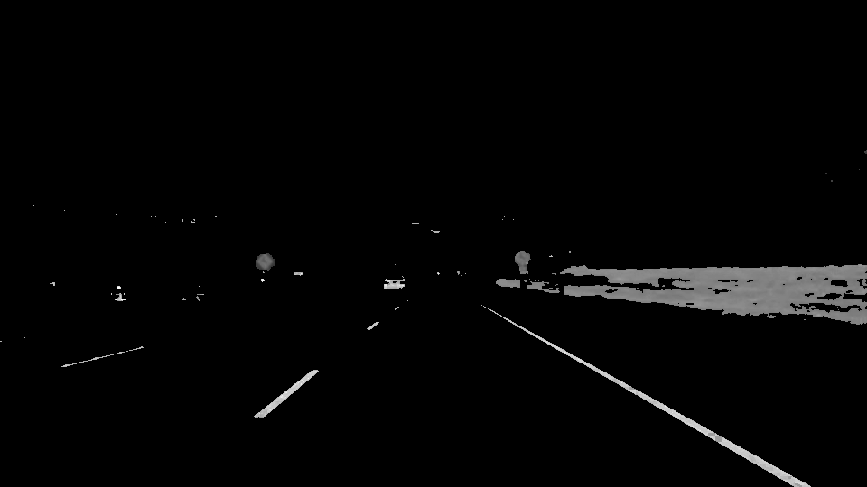
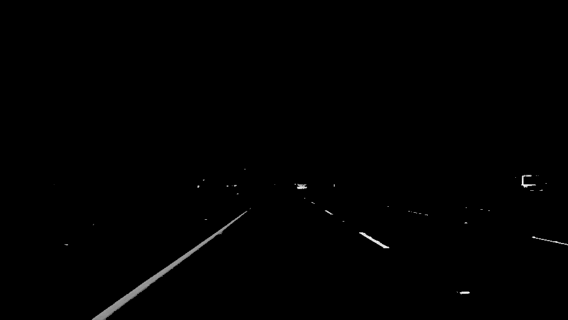
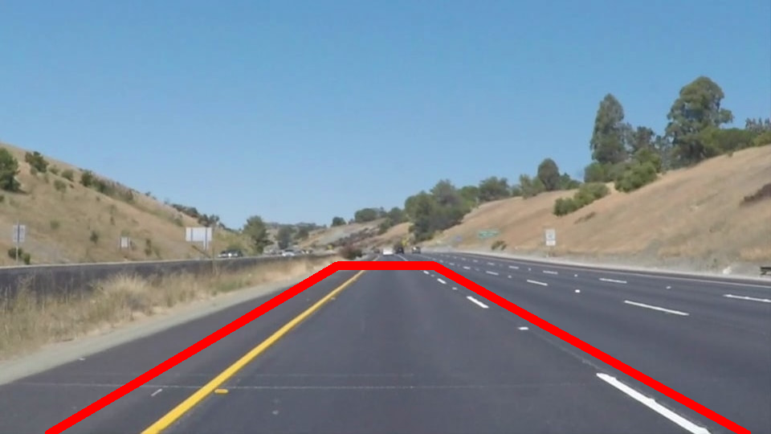
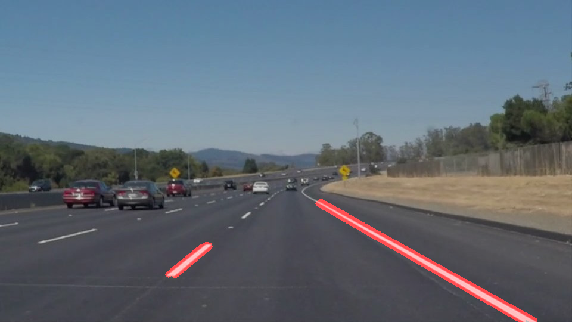
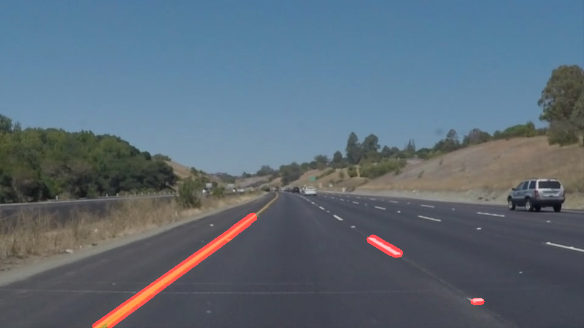
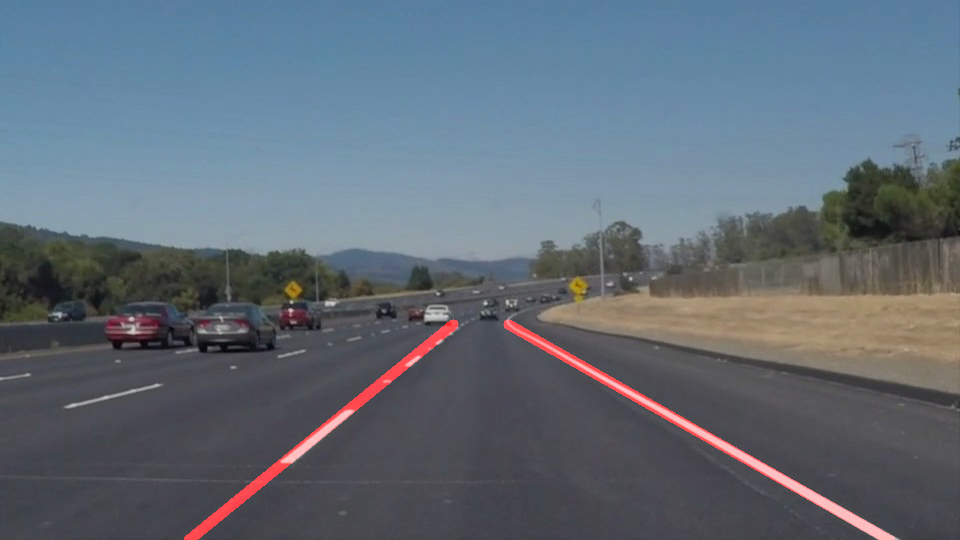
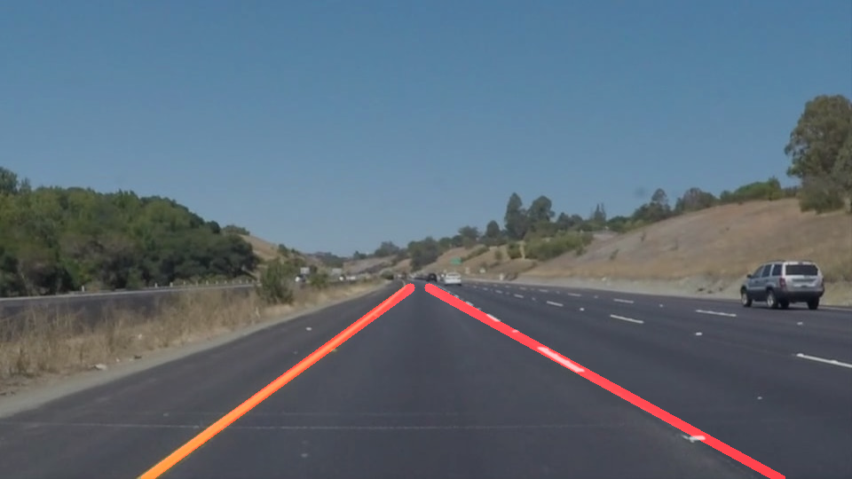

## Project: **Finding Lane Lines on the Road** 

**Pipeline**

Pipeline for this project consist of the following steps:
- Converting image to gray scale after color selection to help capture lane lines
- Use Canny edge detection to detect edges in the images
- Use Hough Transform to convert detected edges to lines in the region of interest in the image
- Use least square fit to find the linear line which are the lane lines in the images 
- Combine the lane lines found with the original image and output final image
- Process video clips as images and apply the above steps to add lane lines to output clip

**Image Processing**

Below are the two main types of lane lines detected in the project, one type is white lane lines, the other is yellow lane lines. 

<figure>
 
 
</figure>

After some iterations based on different images with different brightness and shading (especially after the challenge.mp4 video), the approach chosen was to first convert the image to HLS color scale and filter only white and yellow from the images. Below plots show the result after converting the images to gray scale, which we can clearly detect the lane lines. 

<figure>
 
 
</figure>

Next step was to apply Canny edge detection (by using cv2.Canny) to capture edges. Different Gaussian filter kernel size was tested to smooth out the unwanted objects in the plot. Final kernel size used in the project was 13. 

Below plot shows the region of interest in the images used since the rest of the images will not contain the lane lines.

<figure>
 
</figure>

After Hough transform (by using cv2.HoughLinesP), lane lines were found as shown in plots below. 

<figure>
 
 
</figure>

Next step was to take the lines from Hough transform and use least square fit to find the optimal line to represent the lane lines. The idea was to get the left and right lane lines by distinghish the lane lines based on positive (right) and negative (left) slopes. However, as discovered while checking the result from challenge.mp4 video, there could be 
lines with different slopes on the opposite of the plot which will cause some jumpy lines in the video. To resolve this issue, a boundary condition was set to ensure that the right and left lane lines stay on proper side of the image.

<figure>
 
 
</figure>

**Video Processing**

Video processing was fairly straightforward since by using moviepy.editor to convert video clip to discrete images and then adding lane lines on the images based on the steps above to find lane line in the images. 

There's a couple of improvements that can be done to further optimize the performance. For example, the lane lines in the. ideo are slightly shaky, by applying IIR filter can help stablize the behavior (note that if heavy filtering is applied then the lane lines may not react fast enough so that is one concern of using IIR filtering). Also, the curvature of the lane lines are not captured in this project.  